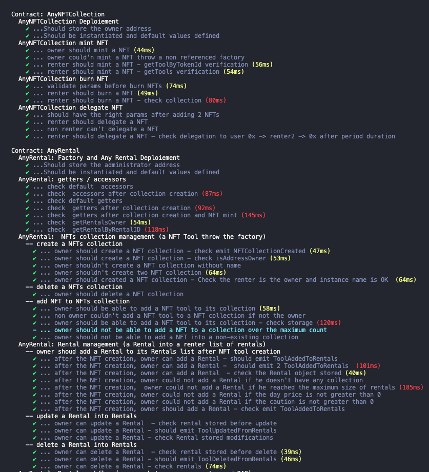
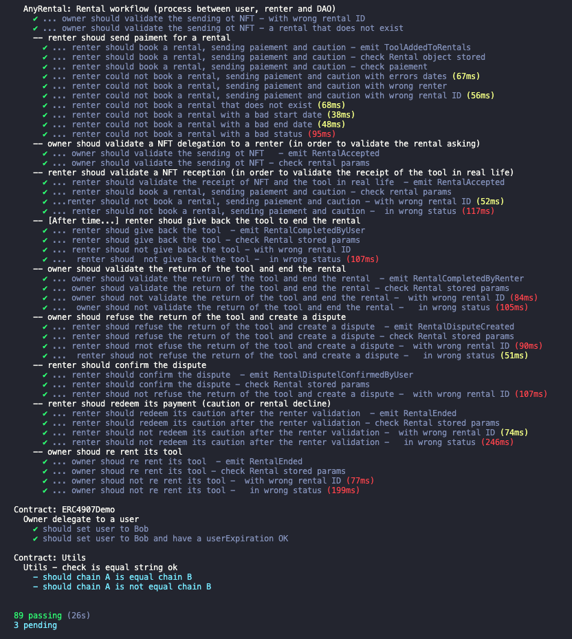
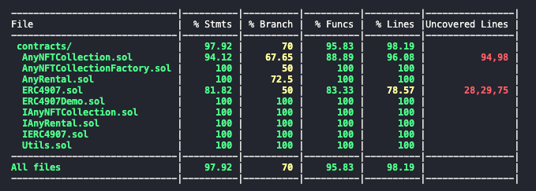
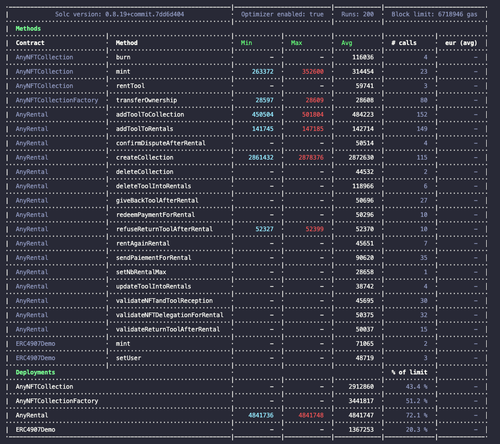
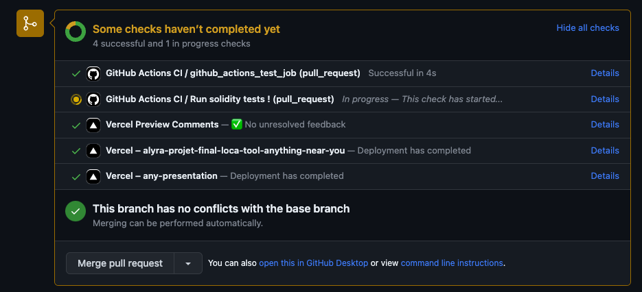
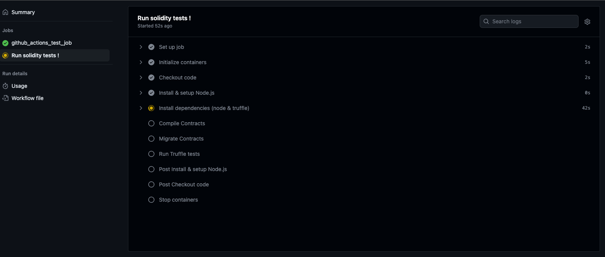

# Projet Final : Loca Tool : Anything Near You

## Url de la démo & prod
- [Vercel url](https://anything-near-you.vercel.app/)
- Vidéos sur loom
   - [Vidéo on loom](https://www.loom.com/share/9e3c7bf988dd4f5581c19c91ea03853f) ou [video youtube](https://youtu.be/nDM1WIbrohE)
   - [Vidéo on loom](https://www.loom.com/share/a905b4aa12a444c0a5e639c25ccc756d) ou [video youtube](https://youtu.be/pN-cQsTc1fo)
- [Slides de presentation](https://any-presentation.vercel.app/)

## Documentation
### Schémas
- [Workflow utilisateur](./Documentation/doc_workflow_utilisateur.md)
- [Architecture / deploiement & droits](./Documentation/doc_architecture.md)
- [Workflow complet](./Documentation/doc_workflow_complet.md)

### Stack technique
- Projet réalisé avec tuffle-box
- React
- Design réalisé avec chakraUI
- Gradients effectués avec [mesher](https://csshero.org/mesher/)
- Présentation effectuée avec [reveal.js](https://revealjs.com/)

## Tests et couverture de code

## Gas reporter

## PR et CI
Utilisation de github actions pour déclencher les TUs a chaque PR.

Puis deploiement auto sur Vercel

## Developpeur - (Plus tard)
Problème de deploiement sur Vercel (les clées de .env ne sont pas prises en compte)

Meme problématique
- https://github.com/vercel/vercel/discussions/5015
- https://github.com/vercel/vercel/discussions/3962

## Solution trouvée
utiliser **vercel cli**

deploiement :  `vercel --prod`

/!\ deploie les fichiers présents... pas de comits !

=> Pas fan... sort du workflow de PR, TU et merge.

Action :  Trouver comment avec react definir de variables contenues dans .env
